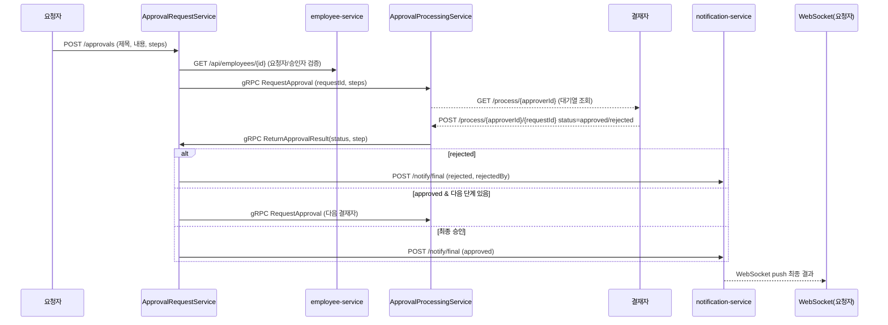

# ERP 승인 시스템 가이드

4개의 마이크로서비스로 구성된 간단한 전자결재(ERP) 예제입니다. 각각 독립적으로 실행되는 Spring Boot 애플리케이션이며, gRPC·REST·WebSocket을 섞어 승인 흐름을 처리합니다.

## 서비스 구성 및 포트
- notification-service (`8080`): WebSocket `/ws?id={employeeId}`로 최종 승인/반려 알림을 푸시, HTTP `POST /notify/final`로 수신
- employee-service (`8081`): 직원 CRUD REST API, MySQL 사용
- ApprovalRequestService (`8082`, gRPC `50051`): 결재 생성/조회 REST API, MongoDB 사용, 승인 결과 gRPC 수신
- ApprovalProcessingService (`8083`, gRPC `50052`): 결재 진행 대기열 관리, 결재자용 REST API, 승인 요청 gRPC 수신

## 실행 전 준비물
- Java 21, Gradle Wrapper 사용(각 서비스 디렉터리에서 `./gradlew` 또는 Windows `gradlew.bat`)
- Docker 또는 로컬 DB
  - MySQL 8: 포트 `3307`, DB `employdb`, 계정 `root` / `123qazasd!`
  - MongoDB: 포트 `27017`, DB `erp_approval`
- 포트 충돌이 없도록 8080/8081/8082/8083, 50051/50052, 27017, 3307을 비워 둡니다.

### DB 기동 예시 (Docker)
```bash
# MySQL
docker run --name employ-mysql -p 3307:3306 \
  -e MYSQL_ROOT_PASSWORD=123qazasd! \
  -e MYSQL_DATABASE=employdb \
  -d mysql:8

# employees 테이블 생성 (employee-service는 ddl-auto: validate)
docker exec -i employ-mysql mysql -uroot -p123qazasd! employdb <<'SQL'
CREATE TABLE IF NOT EXISTS employees (
  id BIGINT AUTO_INCREMENT PRIMARY KEY,
  name VARCHAR(100) NOT NULL,
  department VARCHAR(100) NOT NULL,
  position VARCHAR(100) NOT NULL,
  created_at TIMESTAMP DEFAULT CURRENT_TIMESTAMP
);
SQL

# MongoDB
docker run --name approval-mongo -p 27017:27017 -d mongo:7
```

## 실행 순서
1) DB 기동(MySQL, MongoDB)
2) `notification-service` 실행  
3) `employee-service` 실행  
4) `ApprovalRequestService` 실행  
5) `ApprovalProcessingService` 실행  

각 서비스는 디렉터리에서 아래처럼 실행합니다.
```bash
cd notification-service && ./gradlew bootRun
cd employee-service && ./gradlew bootRun
cd ApprovalRequestService && ./gradlew bootRun
cd ApprovalProcessingService && ./gradlew bootRun
```
Windows PowerShell에서는 `./gradlew` 대신 `.\gradlew.bat` 사용.

## 주요 API/동작

### 1. 직원 서비스 (employee-service, 8081)
- `POST /api/employees`  
  ```bash
  curl -X POST http://localhost:8081/api/employees \
    -H "Content-Type: application/json" \
    -d '{"name":"홍길동","department":"개발","position":"대리"}'
  ```
- `GET /api/employees/{id}` : 단건 조회  
- `GET /api/employees` : 전체 조회  
- `PUT /api/employees/{id}` / `DELETE /api/employees/{id}` : 수정/삭제  
응답은 `ApiResponse` 래퍼로 상태 코드·메시지가 함께 반환됩니다.

### 2. 결재 요청 서비스 (ApprovalRequestService, 8082, gRPC 50051)
- `POST /approvals` : 결재 생성, 단계(step)는 1부터 연속 번호여야 합니다.
  ```bash
  curl -X POST http://localhost:8082/approvals \
    -H "Content-Type: application/json" \
    -d '{
      "requesterId": 1,
      "title": "연차 신청",
      "content": "5/2~5/3 연차 요청",
      "steps": [
        {"step":1,"approverId":2},
        {"step":2,"approverId":3}
      ]
    }'
  ```
- `GET /approvals` / `GET /approvals/{requestId}` : MongoDB에 저장된 결재 조회  
- gRPC 서버(포트 50051)는 Processing 서비스로부터 `ReturnApprovalResult`를 받아 단계를 업데이트하고, 다음 단계가 있으면 다시 gRPC로 전송하거나 최종 결과를 notification-service에 HTTP로 알립니다.
- 외부 연동 설정: `src/main/resources/application.yml`에서 employee-service·notification-service·processing-service의 URL/포트를 조정.

### 3. 결재 진행 서비스 (ApprovalProcessingService, 8083, gRPC 50052)
- gRPC `RequestApproval`: 결재 생성 시 호출되어 결재자의 대기열에 적재.
- `GET /process/{approverId}` : 해당 결재자가 처리할 대기열 목록 조회
- `POST /process/{approverId}/{requestId}` : 결재 처리  
  Body 예시 `{"status":"approved"}` 또는 `{"status":"rejected"}`
  - 승인 시 다음 `pending` 단계가 있으면 그 결재자로 다시 gRPC 요청을 전달
  - 반려 시 즉시 최종 반려로 처리 후 Request 서비스에 gRPC로 결과 회신
- gRPC 클라이언트 대상(host/port)은 `src/main/resources/application.yml`에서 설정.

### 4. 알림 서비스 (notification-service, 8080)
- WebSocket: `ws://localhost:8080/ws?id={employeeId}` 로 연결하면 해당 직원의 최종 승인/반려 메시지를 실시간 수신.
- HTTP: `POST /notify/final` (Request 서비스가 호출)
  ```json
  {
    "requesterId": 1,
    "requestId": 10,
    "result": "approved",
    "finalResult": "approved",
    "rejectedBy": 2 // 반려 시에만 포함
  }
  ```

## 전체 승인 흐름
1) 직원 정보를 employee-service에 미리 등록합니다.  
2) Requester가 ApprovalRequestService에 `/approvals`로 결재를 생성하면 MongoDB에 저장되고 gRPC로 Processing 서비스에 전달됩니다.  
3) Processing 서비스는 첫 `pending` 결재자를 대기열에 넣고, 결재자는 `/process/{approverId}`로 조회 후 승인/반려를 수행합니다.  
4) 결과는 gRPC로 Request 서비스에 전달되어 단계 상태를 업데이트합니다.  
   - 반려면 즉시 최종 반려 후 notification-service에 HTTP 알림 전송  
   - 승인이고 다음 단계가 있으면 다시 Processing으로 전달  
   - 마지막 승인이라면 최종 승인 후 알림 전송  
5) notification-service가 requester의 WebSocket 세션에 최종 결과를 push 합니다.

## 전체 아키텍처 (Mermaid)
```mermaid
flowchart LR
    subgraph Client
        R[Requester\n(REST /approvals)]
        A[Approver\n(REST /process)]
        WS[Requester WebSocket\n/ws?id={id}]
    end

    subgraph Notification
        NS[notification-service\n8080]
    end

    subgraph ApprovalRequest
        AR[ApprovalRequestService\n8082 / gRPC 50051]
        Mongo[(MongoDB\nerp_approval)]
    end

    subgraph ApprovalProcessing
        AP[ApprovalProcessingService\n8083 / gRPC 50052]
    end

    subgraph Employee
        ES[employee-service\n8081]
        MySQL[(MySQL\nemploydb)]
    end

    R -->|REST POST/GET| AR
    AR -->|직원 검증| ES
    ES --> MySQL
    AR --> Mongo

    AR <-->|gRPC RequestApproval / ReturnApprovalResult| AP

    A -->|GET/POST /process| AP

    AR -->|HTTP POST /notify/final| NS
    NS -->|WebSocket push| WS
```

## 승인 흐름 시퀀스 (Mermaid)


## 트러블슈팅/팁
- 포트/호스트를 변경하려면 각 서비스의 `src/main/resources/application.yml`을 확인하세요.
- employee-service는 `ddl-auto: validate`이므로 테이블이 없으면 실행이 실패합니다. 위 SQL로 테이블을 만들어 주세요.
- MongoDB가 비어 있어도 자동 생성되므로 추가 스키마 작업은 필요 없습니다.
